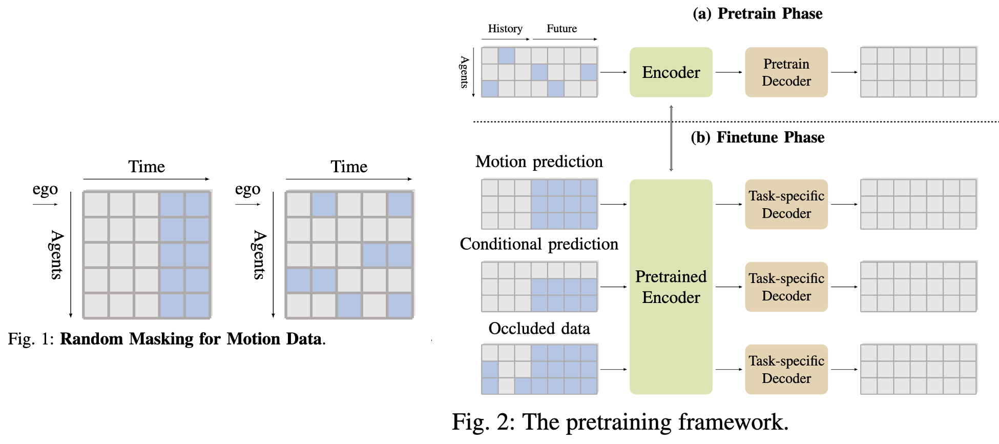
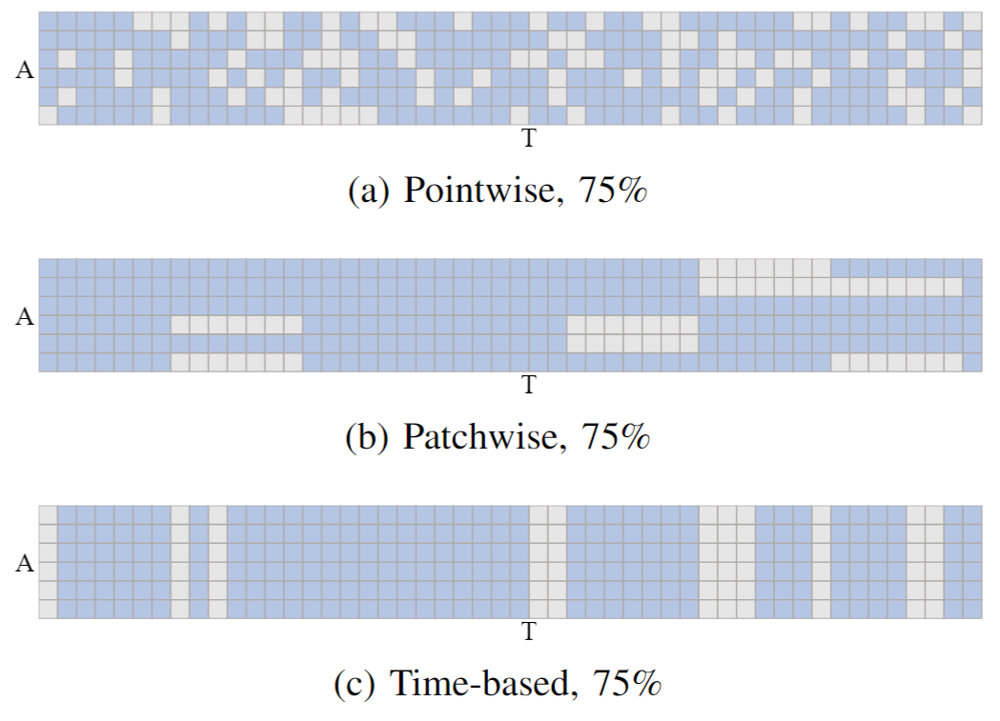
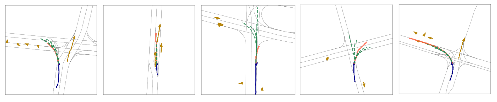
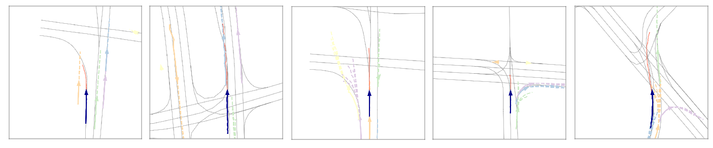

RMP: A Random Mask Pretrain Framework for Motion Prediction
---

[](https://arxiv.org/abs/2309.08989)

We introduce a simple yet potent framework for random masking pretraining for motion tasks. These tasks include motion prediction and occlusion handling. Our method selectively masks motion patches, allowing the random mask to capture spatial and social correlations among all agents in a given scenario. 

The framework has 2 phases. 
<center>

</center>

1. In the first pretrain phase, all agents' information including the history and future time are concatenated together. Random masking is applied. Given incomplete information about agents' positions with time (in grey), where some positions are randomly masked (in blue), the network trains to fill in the blue missing positions. 

2. In the fine-tuning phase, there are three tasks that correspond to three special masking cases. Once trained, the pretrained encoder is used for different tasks.


## Adaptability
We demonstrate its adaptability by incorporating it into several state-of-the-art models, including [AutoBots](https://github.com/roggirg/AutoBots) and [HiVT](https://github.com/ZikangZhou/HiVT). Check the two folders and README under them to do data preparation, run pretraining and fine-tune tasks. 


<figure style="text-align:left;">
  
  <figcaption>Fig.3 - Different mask sampling strategies in pretrain: (a) random pointwise masking, (b) random patchwise masking for random agents, (c) random masking in time. All show 75% masking in total (in blue)  and the remaining data (in grey) will be fed into the network.</figcaption>
</figure>


### Visualization
<figure style="text-align:left;">
  
  <figcaption>Fig.4 - Qualitative results of motion prediction using Autobot with random mask pretrain on Argoverse dataset. The past trajectories of all other vehicles are shown in brown, the past trajectories of ego vehicle are shown in dark blue, the ground-truth trajectories are shown in red, the predicted trajectories are shown in green.</figcaption>
</figure>


<figure style="text-align:left;">
  
  <figcaption>Fig.5 - Qualitative results of conditional motion prediction using Autobot with random mask pretrain on Argoverse dataset. Given the ego vehicle's past (in dark blue) and future (in red) trajectories, and past trajectories of all other vehicles (solid line, one color for one agent), the predicted trajectories of all other agents are shown in the dashed line.</figcaption>
</figure>

## Evaluation on occluded scenarios
Detailed under [Autobots folder](AutoBots/README.md#Evaluate-performance-in-scenarios-with-occlusions)

## Acknowledgements

This implementation is based on codes from several repositories. Thanks for these authors who kindly open-sourcing their work to the community. Please see our paper reference part to get more information.

❤️: [HiVT](https://github.com/ZikangZhou/HiVT), [AutoBots](https://github.com/roggirg/AutoBots), [MultiAgentVariationalOcclusionInference](https://github.com/sisl/MultiAgentVariationalOcclusionInference)

### Cite Our Paper

Please cite our work if you find these useful for your research.

```
@inproceedings{yang2023rmp,
  author={Yi, Yang and Qingwen, Zhang and Thomas, Gilles and Nazre, Batool and John, Folkesson},
  title = {RMP: A Random Mask Pretrain Framework for Motion Prediction},
  booktitle = {IEEE 26th International Conference on Intelligent Transportation Systems (ITSC)},
  year = {2023},
  volume = {},
  number = {},
  pages = {3717-3723},
  keywords = {Self-supervised learning;Switches;Prediction methods;Natural language processing;Trajectory;Task analysis;Autonomous vehicles},
  doi = {10.1109/ITSC57777.2023.10422522},
}
```
